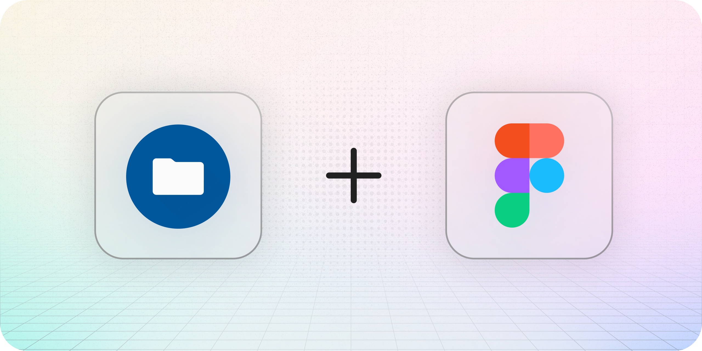

<!-- markdownlint-disable first-line-h1 heading-start-left -->
<!-- markdownlint-disable-next-line -->

  # 🍱 Material Icons for Figma

  

  > Supercharge your **Figma** designs with the most comprehensive **Material Icons** plugin!

A powerful and **completely free** Figma plugin that brings the entire Material Icons library to your fingertips. Seamlessly drag and drop icons into your designs and boost your workflow! ✨

## ✨ Features

- 🎯 **Quick Search** - Find any icon in a fraction of a second
- 🖱️ **Drag & Drop** - Effortless integration into your designs
- 💾 **Offline Support** - Work without internet connection

## 🛠️ Tech Stack

Built with modern technologies for the best performance:

- [**Plugma**](https://www.plugma.dev/)
- [**Vue**](https://vuejs.org/)
- [**Vite**](https://vite.dev/)

This plugin is based on the **npm** library [`material-icon-theme`](https://www.npmjs.com/package/material-icon-theme) which contains fresh icons from [**vscode-material-icon-theme**](https://github.com/material-extensions/vscode-material-icon-theme)

## 🚀 Getting Started

1. Install the plugin from https://www.figma.com/community/plugin/1461657243876074425/material-icons
2. Drag and drop the desired icon from the menu into your design

<!-- TODO: Add demonstration gif -->
